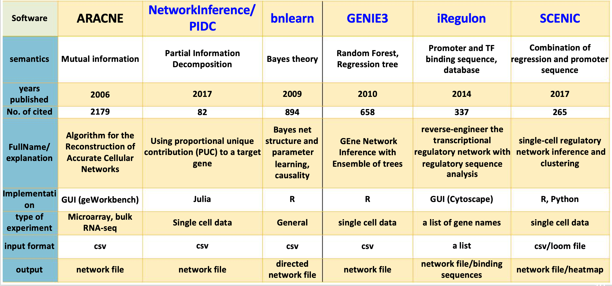

# Please note that NIH VPN connection may cause problems in downloading, and missing images in the github. '
Please disconnect your VPN before downloading. 
# Please go to the BESTversion for the NIH training.

### **Gene_Regulatory_Networks**

The BESTversion of This repository is purposed for the NIH training, Mar 30, 2020.

The [youtube video presentation](https://www.youtube.com/watch?v=eMvUteU3WWk&feature=youtu.be) is ready for you to review.

(Original ACEversion this was for the Uganda training 2020, for Africa Center of Execellence.
There are two sessions in the ACEversion. Session 1 will be on biological backgrounds, information theory-based methods and Bayesian Network. session 2 will be on iRegulon and SCENIC.)

**Contact our team via email:**

bioinformatics@niaid.nih.gov

Instructor: zhuy16@nih.gov

Or leave your question at this Googledoc:
https://tinyurl.com/GRN-best 

For practical materials:
  **git clone https://github.com/niaid/Gene_Regulatory_Networks**

I would also suggest some general tips for learning bioinformatics,
  https://github.com/zhuy16/learning_notes

# Methods covered in this webinar:

