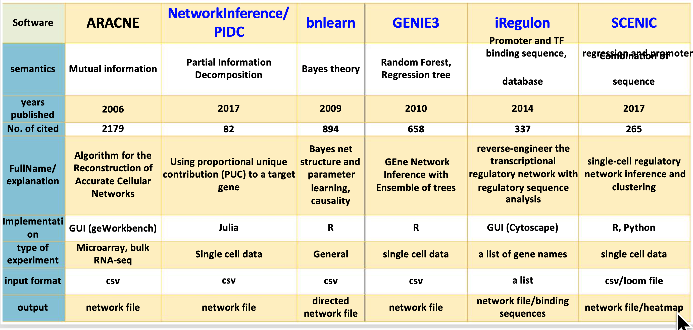

# **Gene_Regulatory_Networks**
This repository is for the Uganda training 2020, on gene regulatory network analysis.
There are two sessions. Session 1 will be on biological backgrounds, information theory-based methods and Bayesian Network. session 2 will be on iRegulon and SCENIC.

**Contact our team via email:**
bioinformatics@niaid.nih.gov

Instructor: zhuy16@nih.gov

Or leave your question at this Googledoc:
https://tinyurl.com/GRN-best 

For practical materials:
  **git clone https://github.com/niaid/Gene_Regulatory_Networks**

Methods covered in this webinar:

